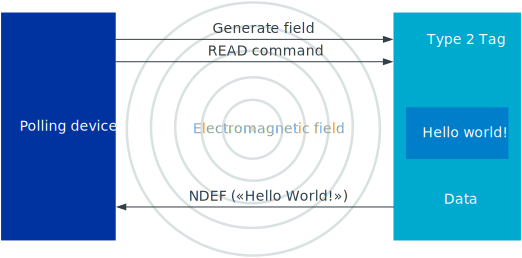
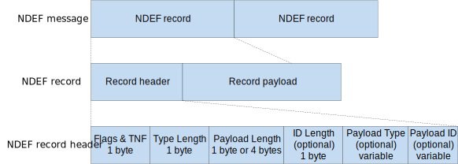
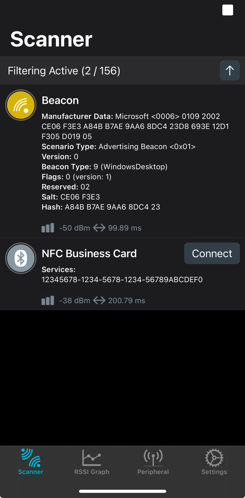
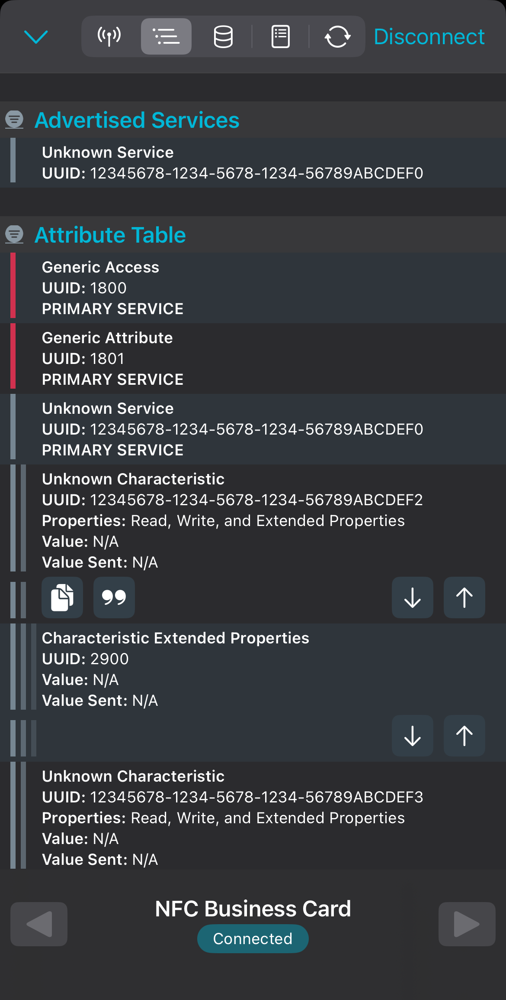
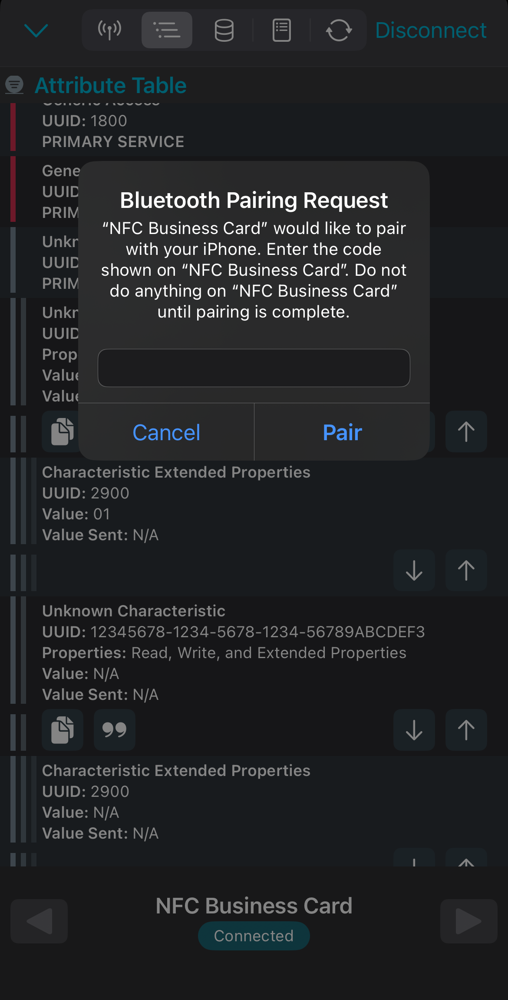
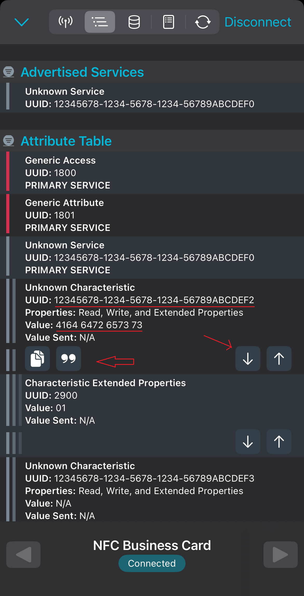
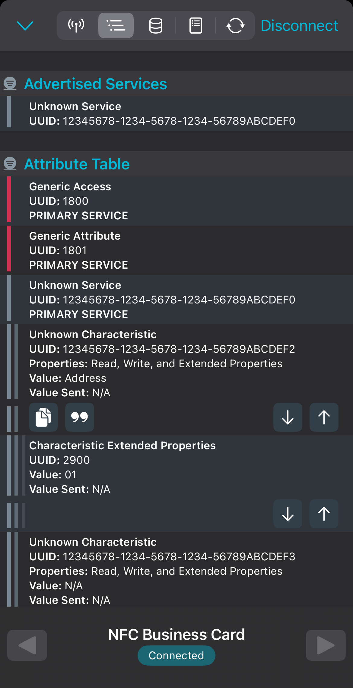
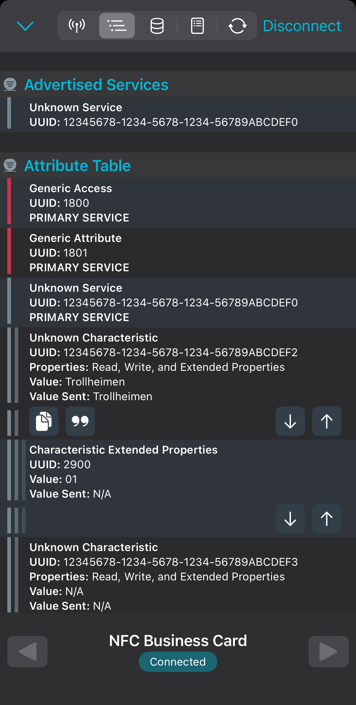
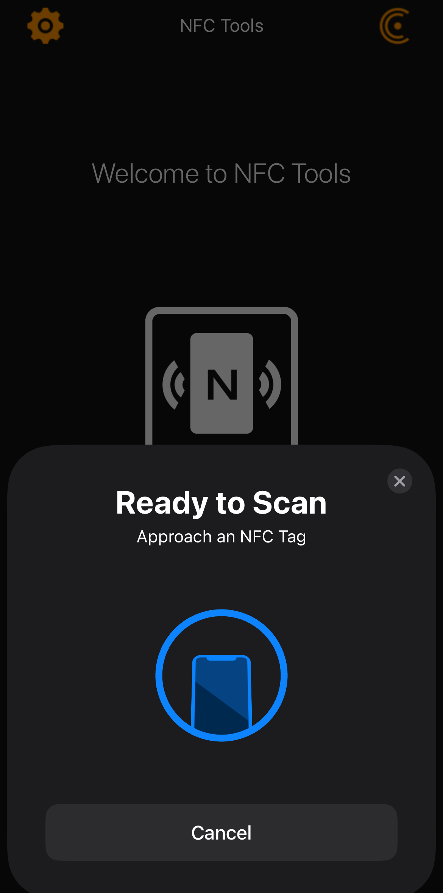
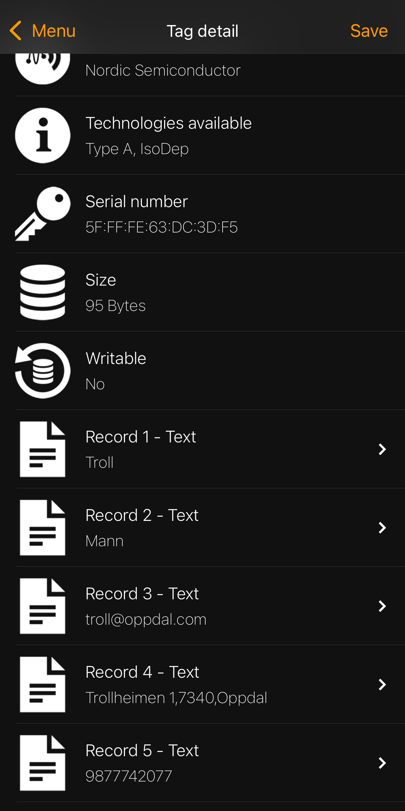

# NFC Business Card Application with nRF54L15 DK

## Introduction

This application demonstrates how to implement an NFC business card using the nRF54L15 Development Kit. The application allows users to program contact information (name, company, phone, email, address) via Bluetooth Low Energy using the nRF Connect for Mobile app. When an NFC-enabled smartphone is tapped against the DK's NFC antenna, it can read the stored contact information.

The application includes the following features:
- Implementation of a custom Bluetooth Service to store and edit contact information
- Configuration of NFC records through this custom Bluetooth Service
- Permanent storage of records that persist through power cycles
- Read-only NFC configuration to prevent unauthorized modification
- Optional Bluetooth LE security to restrict read/write access over Bluetooth
- Power consumption optimization

The nRF Connect SDK is a powerful and versatile software development kit for developing applications that use Bluetooth Low Energy, Bluetooth mesh, NFC, Thread, and IEEE 802.15.4 protocols. The SDK is designed to be modular and extensible, allowing developers to select the components needed for their applications. The SDK's APIs are designed for ease of use, with a focus on simplicity and consistency across different protocols and communication methods. The SDK also provides sample applications and examples that demonstrate how to use the various components and APIs.

This demonstration serves as a reference for embedded developers interested in implementing NFC and Bluetooth Low Energy communication in their applications based on nRF Connect SDK.

### Prerequisite Tools

- nRF Connect SDK v2.9.0
  - Note: The code is tested with nRF Connect SDK v2.9.0 but should also work with other SDK versions.
- nRF54L15 DK (with NFC Antenna)
- Mobile phone with NFC functionality and NFC app
  - Android: [nRF NFC Toolbox](https://www.nordicsemi.com/Products/Development-tools/nRF-NFC-Toolbox)
  - iOS: A suitable NFC app that supports reading of NFC tags
- [nRF Connect for Mobile](https://www.nordicsemi.com/en/Products/development-tools/nrf-connect-for-mobile) app

### Target Audience
Developers interested in combining NFC and Bluetooth applications

## Architecture of the Application

This application has three main components:

1. Bluetooth LE service and characteristics for business card data
2. Settings handling for persistent storage
3. NFC handling for tag emulation

The application also includes a button to erase bonding information and LEDs to indicate NFC field detection.


In subsequent sections, we will explore the technical details of each component and demonstrate how it is implemented step by step.


## Setting up Custom Bluetooth Service

The business card application exposes a custom Bluetooth Low Energy (BLE) service to store contact information. The service contains five characteristics, each representing a different piece of contact information. This service is used to read and write contact information from the application.

### Understanding Bluetooth Service, Characteristics and Generic Attribute Profile (GATT)

The Generic Attribute Profile (GATT) is a protocol that defines how data is structured and
accessed in a Bluetooth Low Energy system. It operates on top of the Attribute Protocol (ATT)
and defines two primary roles: Server and Client. A Server contains the data and provides
access to it, while a Client requests data from the Server and can also write data to the
Server.

GATT outlines the structure of data on the Server side. This data is organized into
Services and Characteristics. A Service can contain multiple Characteristics, and each
Characteristic contains a single value and any number of descriptors that describe the
value.

Services are structured as follows:

- **Service**: A collection of related characteristics identified by a Universally Unique Identifier (UUID)
  - **Standard Services**: Pre-defined by the Bluetooth SIG (16-bit UUIDs)
  - **Custom Services**: Developer-defined for application-specific needs (128-bit UUIDs) (We will use this type).

- **Characteristics**: Individual data elements within a service
  - Each characteristic has a UUID, properties (read, write, notify, etc.), and a value
  - Characteristics can have multiple properties enabling different types of interactions

- **Descriptors**: Optional attributes that provide additional information about characteristics
  - Examples include User Description (CUD), Client Characteristic Configuration (CCCD), and Characteristic Presentation Format (CPF)

This hierarchical structure creates a standardized way for BLE devices to expose their capabilities and exchange data. In our business card application, we leverage this structure to create a custom service with several characteristics that store individual bits of contact information.

### Setting up Custom Bluetooth Service

We will try to use as many standard characteristics as possible to represent the business card data. This will make it easier to implement the application and also make it more compatible with other devices. The standardized characteristics are defined in [GATT Specification Supplement](https://www.bluetooth.com/specifications/gss/).

We will use the following standardized characteristics: [First Name](https://bitbucket.org/bluetooth-SIG/public/src/main/gss/org.bluetooth.characteristic.first_name.yaml), [Last Name](https://bitbucket.org/bluetooth-SIG/public/src/main/gss/org.bluetooth.characteristic.last_name.yaml), and [Email Address](https://bitbucket.org/bluetooth-SIG/public/src/main/gss/org.bluetooth.characteristic.email_address.yaml).

The service structure will look as follows:

- **Service Definition**: Custom service with five characteristics
- **Characteristics**:
  - First Name (UUID 0x2A8A)
  - Last Name (UUID 0x2A90)
  - Email Address (UUID 0x2A87)
  - Phone Number (custom UUID)
  - Address (custom UUID)
- **Extended Properties**: Implementation of reliable writes using Characteristic Extended Properties (CEP)
- **Security Requirements**: Encryption requirements for accessing characteristics

We will use extended properties to implement reliable writes. This will allow us to write data to the characteristics in a reliable manner. This is done by setting the `BT_GATT_CHRC_EXT_PROP` property and implementing the `BT_GATT_PERM_PREPARE_WRITE` permission.

Additionally, we will enable security requirements for accessing characteristics. This will ensure that only authorized devices can read and write to the characteristics. We will use encryption to protect the data from unauthorized access. This is specified by `BT_GATT_PERM_READ_ENCRYPT` and `BT_GATT_PERM_WRITE_ENCRYPT` permissions.

The service definition would then look as follows:

```c
BT_GATT_SERVICE_DEFINE(nfc_bizcard_svc,
        BT_GATT_PRIMARY_SERVICE(&nfc_bizcard_uuid),
        BT_GATT_CHARACTERISTIC(&first_name_uuid.uuid,
                BT_GATT_CHRC_READ | BT_GATT_CHRC_WRITE | BT_GATT_CHRC_EXT_PROP,
                BT_GATT_PERM_READ_ENCRYPT | BT_GATT_PERM_WRITE_ENCRYPT |
		BT_GATT_PERM_PREPARE_WRITE,
                read_name, write_long_name, first_name_value),
        BT_GATT_CEP(&nfc_bizcard_cep),
        BT_GATT_CHARACTERISTIC(&last_name_uuid.uuid,
                BT_GATT_CHRC_READ | BT_GATT_CHRC_WRITE | BT_GATT_CHRC_EXT_PROP,
                BT_GATT_PERM_READ_ENCRYPT | BT_GATT_PERM_WRITE_ENCRYPT |
		BT_GATT_PERM_PREPARE_WRITE,
                read_last_name, write_long_last_name, last_name_value),
        BT_GATT_CEP(&nfc_bizcard_cep),
        BT_GATT_CHARACTERISTIC(&email_uuid.uuid,
                BT_GATT_CHRC_READ | BT_GATT_CHRC_WRITE | BT_GATT_CHRC_EXT_PROP,
                BT_GATT_PERM_READ_ENCRYPT | BT_GATT_PERM_WRITE_ENCRYPT |
		BT_GATT_PERM_PREPARE_WRITE,
                read_email, write_long_email, email_value),
        BT_GATT_CEP(&nfc_bizcard_cep),
        BT_GATT_CHARACTERISTIC(&address_uuid.uuid,
                BT_GATT_CHRC_READ | BT_GATT_CHRC_WRITE | BT_GATT_CHRC_EXT_PROP,
                BT_GATT_PERM_READ_ENCRYPT | BT_GATT_PERM_WRITE_ENCRYPT |
		BT_GATT_PERM_PREPARE_WRITE,
                read_address, write_long_address, address_value),
        BT_GATT_CEP(&nfc_bizcard_cep),
        BT_GATT_CHARACTERISTIC(&phone_number_uuid.uuid,
                BT_GATT_CHRC_READ | BT_GATT_CHRC_WRITE | BT_GATT_CHRC_EXT_PROP,
                BT_GATT_PERM_READ_ENCRYPT | BT_GATT_PERM_WRITE_ENCRYPT |
		BT_GATT_PERM_PREPARE_WRITE,
                read_phone_number, write_long_phone_number, phone_number_value),
        BT_GATT_CEP(&nfc_bizcard_cep)
);
```

### Read/Write Handlers

The read and write handlers are functions that are called whenever a read or write is done on a characteristic. The handlers are responsible for retrieving or storing the value of the characteristic.

When a write is performed, we need to save the value to the settings subsystem and refresh the NFC record. We will look at the NFC part a little later.

For example, the read and write handlers for the first name characteristic are implemented as follows:

```c
static ssize_t read_name(struct bt_conn *conn, const struct bt_gatt_attr *attr,
			void *buf, uint16_t len, uint16_t offset)
{
	const char *value = attr->user_data;

	return bt_gatt_attr_read(conn, attr, buf, len, offset, value, strlen(value));
}

static ssize_t write_long_name(struct bt_conn *conn, const struct bt_gatt_attr *attr,
			 const void *buf, uint16_t len, uint16_t offset, uint8_t flags)
{
	uint8_t *value = attr->user_data;

	if (flags & BT_GATT_WRITE_FLAG_PREPARE) {
		return 0;
	}

	if (offset + len > NAME_MAX_LEN) {
		printk("Invalid input length: offset %d, len %d, max %d\n", offset, len, NAME_MAX_LEN);
		return BT_GATT_ERR(BT_ATT_ERR_INVALID_OFFSET);
	}

	memcpy(value + offset, buf, len);
	value[offset + len] = 0;

	settings_save_one("card/fn", value, strlen(value) + 1);

        //TODO: Refresh the NFC record

	return len;
}
```

We will also have to define handlers for the settings subsystem and load the data in memory variables upon bootup. The commit callback is called when all settings have finished loading, and in this callback we will refresh the NFC record.

```c
static int card_set(const char *name, size_t len, settings_read_cb read_cb, void *cb_arg);
static int card_commit(void);

/* Define static settings handler for user data.
 * Data will be saved  as "card/fn", "card/ln", etc. by using settings_save_one().
 * Data will be retrived in application variables by using single set handler.
 */
SETTINGS_STATIC_HANDLER_DEFINE(bizcard, "card", NULL, card_set, card_commit, NULL);

static int card_set(const char *name, size_t len, settings_read_cb read_cb, void *cb_arg)
{
	const char *next;
	size_t name_len;
	int rc;

	name_len = settings_name_next(name, &next);

	if (!next) {

		if (!strncmp(name, "fn", name_len)) {
			rc = read_cb(cb_arg, first_name_value, sizeof(first_name_value));
			if (rc < 0 || rc > sizeof(first_name_value)) {
				printk("card/fn read failed: rc %d\n", rc);
				return rc;
			}
			printk("card/fn read: %s\n", first_name_value);
			return 0;
		}

		//... similarly load other fields ...
	}

	return -ENOENT;
}

/* Commit callback. Called when all settings have finished loading. */
static int card_commit(void)
{
	printk("Loading NFC tag data\n");

	//TODO: Refresh the NFC record

	return 0;
}
```

### Securing the Bluetooth Service

We will enable encryption and authentication for the characteristics. This means that only authorized devices with the correct encryption keys can read and write to the characteristics. We have already added `BT_GATT_PERM_READ_ENCRYPT` and `BT_GATT_PERM_WRITE_ENCRYPT` permissions to specify the security requirements in the code snippet shown above.

For securing the connection, we will use highest level of security with Man-In-The-Middle (MITM) attack protection. In order to do so, we need Out-of-Band (OOB) channel to share the authentication related information. Therefore we will use passkey based method, where embedded device displays the passkey. Then, user acts as a OOB channel, reads the passkey and inputs it on the mobile app. We will use highest level of security mechanism utilizing Elliptic Curve Diffie-Hellman (ECDH) based key exchange algorithm. This feature is called as LE Secure Connections. To enable this feature, we will use `CONFIG_BT_SMP_SC_ONLY` and `CONFIG_BT_SMP_SC_PAIR_ONLY` options and disallow usage of weaker security modes.

To use passkey, we need to define and connect callbacks necessary for implementing the secure connections. We will need two callbacks:

1. `passkey_display` - callback will be called to display the passkey on the embedded device. As embedded device in this case will not accept input, we will not use `passkey_entry` callback.
2. `cancel` - callback must be provided and will be called when the pairing is cancelled or passkey should stop displaying.

Additionally we will also provides callbacks for authentication information display to tell user the status of the pairing procedure.

Following is the code snippet showing how to define and register the authentication callbacks:

```c
/* Authentication callbacks */
static void auth_passkey_display(struct bt_conn *conn, unsigned int passkey)
{
	char addr[BT_ADDR_LE_STR_LEN];

	bt_addr_le_to_str(bt_conn_get_dst(conn), addr, sizeof(addr));

	printk("Passkey for %s: %06u\n", addr, passkey);
}

static void auth_cancel(struct bt_conn *conn)
{
	char addr[BT_ADDR_LE_STR_LEN];

	bt_addr_le_to_str(bt_conn_get_dst(conn), addr, sizeof(addr));

	printk("Pairing cancelled: %s\n", addr);
}

static void pairing_complete(struct bt_conn *conn, bool bonded)
{
	char addr[BT_ADDR_LE_STR_LEN];

	bt_addr_le_to_str(bt_conn_get_dst(conn), addr, sizeof(addr));

	printk("Pairing completed: %s, bonded: %d\n", addr, bonded);
}

static void pairing_failed(struct bt_conn *conn, enum bt_security_err reason)
{
	char addr[BT_ADDR_LE_STR_LEN];

	bt_addr_le_to_str(bt_conn_get_dst(conn), addr, sizeof(addr));

	printk("Pairing failed: %s, reason: %d\n", addr, reason);
}

/* Register authentication callbacks */
static struct bt_conn_auth_cb auth_cb_display = {
	.passkey_display = auth_passkey_display,
	.passkey_entry = NULL,
	.cancel = auth_cancel,
};

/* Register pairing callbacks */
static struct bt_conn_auth_info_cb auth_info_cb = {
	.pairing_complete = pairing_complete,
	.pairing_failed = pairing_failed
};

static void bt_ready(int err)
{
        // ...
	/* Register authentication callbacks */
	err = bt_conn_auth_cb_register(&auth_cb_display);
	if (err) {
		printk("Failed to register authentication callbacks (err %d)\n", err);
		return;
	}

	/* Register pairing callbacks */
	err = bt_conn_auth_info_cb_register(&auth_info_cb);
	if (err) {
		printk("Failed to register pairing callbacks (err %d)\n", err);
		return;
	}

	//...
}
```

### Enabling Bluetooth Advertisements

Now, enable the Bluetooth advertisements. This requires setting up the advertising data and starting the advertising set. We will use the extended advertising API for this purpose as this API allows us to start advertising only for a specified duration. This will be our power-saving feature!

To create advertisments following steps would be needed:

1. Define the start parameters
  * Specify advertisement timeout of `APP_ADV_TIMEOUT` in 10s of milliseconds
  * Specify no limit on number of advertising events sent
2. Define the advertising parameters
  * Use connectable and scannable advertising
  * Use fast advertising intervals
  * Do not specify the peer address, as this is not a targeted advertisement
3. Create the advertising set
  * Use the advertisement created in step 2
  * Specify advertisement and scan data
  * Do not specify the callback for notifying advertiser activity
4. Start the advertising set

Following code snippet shows how this can be done:

```c
static void advertising_start(void)
{
	int err;
	struct bt_le_ext_adv *adv;
	struct bt_le_ext_adv_start_param start_param =
		BT_LE_EXT_ADV_START_PARAM_INIT(APP_ADV_TIMEOUT * 100, 0);

	struct bt_le_adv_param adv_param =
		BT_LE_ADV_PARAM_INIT(BT_LE_ADV_OPT_CONNECTABLE | BT_LE_ADV_OPT_SCANNABLE,
					BT_GAP_ADV_FAST_INT_MIN_2, BT_GAP_ADV_FAST_INT_MAX_2, NULL);

	/* Create a connectable advertising set */
	err = bt_le_ext_adv_create(&adv_param, NULL, &adv);
	if (err) {
		printk("Failed to create advertising set (err %d)\n", err);
		return;
	}

	/* Set advertising data to have complete local name set */
	err = bt_le_ext_adv_set_data(adv, adv_data, ARRAY_SIZE(adv_data),
				    scan_data, ARRAY_SIZE(scan_data));
	if (err) {
		printk("Failed to set advertising data (err %d)\n", err);
		return;
	}

	err = bt_le_ext_adv_start(adv, &start_param);
	if (err) {
		printk("Failed to start extended advertising (err %d)\n", err);
		return;
	}

        // ...
}
```

With this, we have completed the Bluetooth part of the application. Now, we need to add NFC tag interfacing to the application.

## Adding NFC Tag Interfacing

Near Field Communication (NFC) is a short-range wireless technology supported by the nRF Connect SDK that enables efficient data exchange between compatible devices. BLE data exchange involves multi-message communication, establishment of connections, and higher throughput data transfers. In contrast, NFC exchanges data only when an NFC reader is present. Communicating over NFC requires devices to be in close proximity (within 10 cm) as it relies on magnetic induction for communication and it is suitable for exchanging small amounts of data.



The nRF Connect SDK provides comprehensive NFC support through libraries that implement [Type 2](https://docs.nordicsemi.com/bundle/ncs-latest/page/nrfxlib/nfc/doc/type_2_tag.html#type-2-tag) Tag and [Type 4](https://docs.nordicsemi.com/bundle/ncs-latest/page/nrfxlib/nfc/doc/type_4_tag.html#type-4-tag) Tag protocol stacks based on NFC Forum specifications. These libraries, available as precompiled components in the nrfxlib repository.

In order to add NFC Type 2 Tag emulation we will first have to initialize the NFC library and configure the Type 2 Tag data with our business card data. It is fairly simple and easy to do.

### NFC Type 2 Tag Initialization

First initialize the NFC library and setup the callback. We will use this callback to provide LED indication of NFC field detection. In the callback we will intercept `NFC_T2T_EVENT_FIELD_ON` and `NFC_T2T_EVENT_FIELD_OFF` events to turn on and turn off the NFC field LED.

Following is the code snippet showing how to initialize the NFC library and setting up the callback:

```c
/* Callback to process NFC field detection */
static void nfc_callback(void *context, nfc_t2t_event_t event, const uint8_t *data,
			 size_t data_length)
{
	ARG_UNUSED(context);
	ARG_UNUSED(data);
	ARG_UNUSED(data_length);

	switch (event) {
		case NFC_T2T_EVENT_FIELD_ON:
			dk_set_led_on(NFC_FIELD_LED);
			break;
		case NFC_T2T_EVENT_FIELD_OFF:
			dk_set_led_off(NFC_FIELD_LED);
			break;
		default:
			break;
	}
}

//...

int main(void)
{
	//...

	/* Set up NFC */
	err = nfc_t2t_setup(nfc_callback, NULL);
	if (err < 0) {
		printk("Cannot setup NFC T2T library!\n");
		return err;
	}

	//...

}
```

### NFC Type 2 Tag Configuration

Next we will configure the Type 2 Tag data with our business card data.

NFC uses NDEF (NFC Data Exchange Format) messages to communicate given data. NDEF messages are a set of records that can be read and written by NFC readers. NDEF message consists of one or more NDEF records.



You can read more information about [NDEF message format](https://docs.nordicsemi.com/bundle/ncs-latest/page/nrf/protocols/nfc/index.html#ndef_message_and_record_format) in nRF Connect SDK documentation.

We will use the NFC NDEF message formatting library to create a properly formatted message for NFC readers. We want to write each field of our business card data as a separate NDEF record so that it can be easier for users to see this information on their NFC app.

We also need to ensure that NFC tag data is updated when the business card data is changed. We will do this by combining all NFC data update functions into a single function (`nfc_record_refresh()`) and calling this function from appropriate Bluetooth callbacks. Remember the `//TODO: Refresh the NFC record` note shown in the snippet above? We will call this function at that location from the write callback of each characteristic. Additionally, we will also call this function from the `commit()` callback of the settings subsystem to initialize NFC card data when settings are loaded.

Following code snippet shows how to create a properly formatted message, note that only one business card field is shown here for simplicity.

```c
/* Encode message */
static int msg_encode(uint8_t *buffer, uint32_t *len)
{
	int err;

	/* Create NFC NDEF text record for each business card field in English */
	NFC_NDEF_TEXT_RECORD_DESC_DEF(nfc_fn_text_rec, UTF_8, en_code, sizeof(en_code),
				      first_name_value, strlen(first_name_value));

	//... define other fields ...

	/* Create NFC NDEF message description, capacity - MAX_REC_COUNT records */
	NFC_NDEF_MSG_DEF(nfc_text_msg, MAX_REC_CNT);

	/* Add text records to NDEF text message */
	err = nfc_ndef_msg_record_add(&NFC_NDEF_MSG(nfc_text_msg),
					 &NFC_NDEF_TEXT_RECORD_DESC(nfc_fn_text_rec));
	if (err < 0) {
		printk("Cannot add first name record!\n");
		return err;
	}

	//... add other fields ...

	return 0;
}

static void nfc_record_refresh(uint8_t *buffer, uint32_t len)
{
	int err;

	err = msg_encode(buffer, &len);
	if (err < 0) {
		printk("Cannot encode message! err %d\n", err);
		return;
	}

	/* Set created message as the NFC payload */
	err = nfc_t2t_emulation_stop();
	if (err == -NRF_EOPNOTSUPP) {
		printk("NFC already stopped\n");
	}

	err = nfc_t2t_payload_set(buffer, len);
	if (err < 0) {
		printk("Cannot set payload! err %d\n", err);
		return;
	}

	/* Start sensing NFC field */
	err = nfc_t2t_emulation_start();
	if (err < 0) {
		printk("Cannot start emulation! err %d\n", err);
		return;
	}
}
```

With this, we have completed the NFC tag interfacing part of the application.

Now our application is ready to be built and flashed to the nRF54L15 DK.

## Building and Flashing

The full source code of the application is available at the following location:

```
https://github.com/omkar3141/peripheral_and_nfc.git
```

1. Checkout the code in your workspace
```bash
git clone https://github.com/omkar3141/peripheral_and_nfc.git
```

2. Build the application.
```bash
west build -b nrf54l15dk/nrf54l15/cpuapp -p
```

## Running the Application

Follow these steps to run the application and see the demonstration.

1. Connect the nRF54L15 DK to your computer.
2. Make sure to connect to the VCOM1 serial port of the DK. Use a preferred terminal emulator to connect. Use 115200 baudrate with 8 data bits, no parity, 1 stop bit, and no flow control.
3. Erase the chip and flash the application to the connected DK.
```bash
west flash --erase
```
> Note: If a verification error occurs while trying to flash the board then use `west flash --erase --recover` command.

4. After the device reboots, the following output will appear in the terminal:
```
*** Booting nRF Connect SDK v2.9.0-7787b2649840 ***
*** Using Zephyr OS v3.7.99-1f8f3dc29142 ***
[00:00:00.006,839] <inf> fs_nvs: 2 Sectors of 4096 bytes
[00:00:00.006,845] <inf> fs_nvs: alloc wra: 0, fd0
[00:00:00.006,849] <inf> fs_nvs: data wra: 0, 0
[00:00:00.006,909] <inf> bt_sdc_hci_driver: SoftDevice Controller build revision:
                                            2d 79 a1 c8 6a 40 b7 3c  f6 74 f9 0b 22 d3 c4 80 |-y..j@.< .t.."...
                                            74 72 82 ba                                      |tr..
[00:00:00.008,208] <inf> bt_hci_core: HW Platform: Nordic Semiconductor (0x0002)
[00:00:00.008,222] <inf> bt_hci_core: HW Variant: nRF54Lx (0x0005)
[00:00:00.008,236] <inf> bt_hci_core: Firmware: Standard Bluetooth controller (0x00) Version 45.41337 Build 3074452168
[00:00:00.008,439] <inf> bt_hci_core: No ID address. App must call settings_load()

Bluetooth initialized
Loading NFC tag data
NFC already stopped
[00:00:00.008,731] <inf> bt_hci_core: Identity: C0:F0:B0:06:BF:7C (random)
[00:00:00.008,747] <inf> bt_hci_core: HCI: version 6.0 (0x0e) revision 0x306b, manufacturer 0x0059
[00:00:00.008,761] <inf> bt_hci_core: LMP: version 6.0 (0x0e) subver 0x306b
Advertising successfully started (will auto-stop after 20 seconds)
Passkey authentication enabled - passkey will be displayed when needed
Press Button 1 to remove all bonds
```

5. Launch nRF Connect Mobile app and click `Connect` to connect to the device. As we have set time-limit (`APP_ADV_TIMEOUT`), the advertising will stop after 20 seconds to save power. If that happens, reboot the device.


<br>

6. After connecting, the mobile app will discover the custom service on the device and list the characteristics. You can see the characteristics we have defined in the application.


<br>

7. Now, reading or writing to the characteristics is not possible yet! As security is enabled for the characteristics, pairing the device with the mobile app is required. To do so, try to
read any of the characteristics related to the NFC business card data.

  > Characteristics related to the NFC business card application will be shown as one of the following:
  >
  > * Unknown Characteristic
  > * First Name
  > * Last Name
  > * Email Address

  Let's select the first Unknown Characteristic and click Downward-pointing-arrow (&DownArrow;).

8. As soon as this is done, the stack will trigger pairing procedure. It will print the passkey on console, and mobile app will ask for the passkey. Enter the passkey in the mobile app.
  ```
  Passkey for 57:B1:4F:3B:E8:52 (random): 010522
  ```


<br>

9. Now let's read the first "Unknown Characteritic" with UUID `12345678-1234-5678-1234-56789abcdef2`. This will show a value in the form of several numbers.


<br>

10. Change it to human-readable form by changing the displayed format. Click on 'double quotes' (&quot;) icon, and change display to UTF-8. Now the characteristic shows the value as "Address".


<br>

11. Now, to write the value, click on the upward-pointing-arrow (&UpArrow;) icon, select "UTF-8", type some address shorter than `ADDRESS_MAX_LEN` length, and click "Write". Verify that the value is written by reading it back by clicking on the downward-pointing-arrow (&DownArrow;) icon.


<br>

12. Similarly, read and change the display format for all other characteristics for business card data and provide some valid values as desired. Make sure to not exceed the maximum length of each field.

Optionally, disconnect the BLE connection after completing the task.

13. Now, launch the NFC reader app on the mobile phone to read the tag data. On Android use nRF NFC Toolbox. Since I have iOS based device, I decided to use "NFC Tools" app. On this app, click "Read" button to make the app ready to scan the NFC Tag.


<br>

14. After this, touch the mobile phone to the NFC antenna of the nRF54L15 DK. The data read from the tag will appear in the app.


<br>

With this, we have completed the demonstration of the NFC business card application !

#### Removing Bond

15. To remove the bond, press Button 1. This will remove the bond and disconnect the device.

16. Do not forget to remove bond from your mobile phone as well. Do do so, open Bluetooth settings on your phone and remove the paired "NFC Business Card" device.

## Something to Explore Further

### Power Consumption

We have used time-limited BLE advertisements to reduce power consumption. There are additional mechanisms that can help you reduce power consumption even more. Can you try to implement them? Some of the tips on what you could do are as follows:

1. Disable LEDs and Buttons to conserve power.
2. Removing support for buttons will also remove the feature to erase the bond by button press, can you think of some other way to erase the bond in this case?
3. Remove console support to disable UART and save some additional power.

### Additional Exercise
1. Add one more characteristic to capture Gender information.
2. Add appropriate human-readable prefixes to NFC records such that instead of showing first name directly on the app, it shows "First Name: <first_name>".


## Conclusion

In this blog post, we learned how to use the nRF Connect SDK to create an NFC Business Card application.  We explored how to use NCS APIs to create a custom BLE service, enable security requirements for service characteristics, and how to implement NFC tag that can exchange the data supplied by the user. Finally, we tested the application using the nRF Connect Mobile app and saw how to read and write data from the BLE characteristics.
